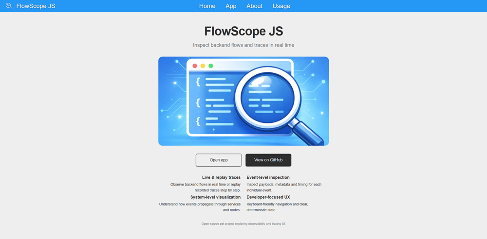
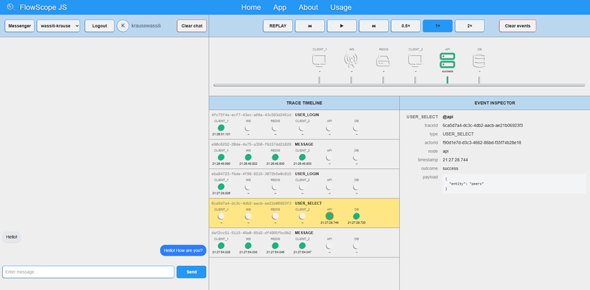

# FlowScope.js

**FlowScope.js** is a pet project that combines a real asynchronous system (a messenger) with a backend process visualization tool, designed for convenient debugging and exploration of data flows and system states.

The project makes asynchronous processes **observable, reproducible, and analyzable** in a clear and visual form.

---

## 🔗 Live Demo

[https://flowscopejs.vercel.app](https://flow-scope-js.vercel.app/)

## 📷 Screenshots

### Main Interface



### Process Visualization



## 🎯 Project Purpose

When developing asynchronous backend systems (WebSocket, events, queues, background processes), it is often difficult to:

- understand what is happening inside the backend at a specific moment
- track the order of event processing
- observe state changes step by step
- analyze cause-and-effect relationships between processes

**FlowScope.js addresses these challenges** by providing a tool to visualize internal backend processes in real time and in a replay mode.

---

## 🧩 Project Structure

The project consists of two logically connected parts.

### 📨 Asynchronous Messenger

A full-featured real-time messaging system enabling live interaction between clients and the server.

The messenger serves as a **live environment** where real asynchronous processes, events, and state transitions occur.

---

### 🔍 Process Visualization Tool

An interface for displaying:

- events
- states
- data flows
- internal processing steps

Diagnostic data can be sent from any part of the backend, where it is structured, stored, and displayed as a sequence of steps available for analysis.

---

## 💡 Key Idea

> Asynchronous processes can be made transparent and observable.

FlowScope.js demonstrates an approach where internal backend logic becomes clear and easy to explore, going beyond traditional logging.

---

## 🛠 Technologies Used

### Frontend

- React / Next.js
- JavaScript / TypeScript
- WebSocket
- Supabase Auth

### Backend

- Node.js
- WebSocket server
- Redis (used as an event stream for messaging and event tracking)

### Infrastructure

- Docker
- Docker Compose

---

## 📐 Architecture (Brief Overview)

- **Backend**

  - processes messenger events
  - records events and states using Redis Streams
  - sends data to the visualization system

- **Frontend**
  - connects to the backend via WebSocket
  - displays processes and states
  - allows step-by-step replay of execution

---

## ⚙️ Requirements

To run the project locally, the following are required:

- Docker (with Docker Compose support)
- Node.js >= 18
- npm

---

## 🚀 Running the Project

### Backend (Docker Compose)

Backend services are started using Docker Compose and include:

- WebSocket server
- Redis

Run with a single command:

```bash
docker compose up
```

After startup, the services are ready to accept connections from the frontend client.

## Frontend

### Local Development

Local Development

- npm install
- npm run dev

### Deployment

The frontend can be deployed, for example, on Vercel.  
When deploying, the appropriate environment variables must be provided.

---

## 🔐 Environment Variables

The project uses environment variables to configure:

- backend services
- frontend client
- Supabase
- OAuth providers

Real values and secrets are **not stored in the repository**.

To configure the project, create a `.env` file based on the provided `.env.example`.

---

## 🔑 Authentication

**Supabase** is used for user authentication.

Supported authentication methods:

- Email
- Google OAuth

After successful registration, the user is automatically added to the `users` table.

Some Supabase and OAuth settings are configured manually via the Supabase Dashboard.

---

## 🗄 Database

The project assumes the presence of a `users` table.

Database migrations are handled via Supabase.

---

## ⚠️ Project Limitations

- not production-ready
- not optimized for high load
- backend availability may be limited
- intended for research, experimentation, and architectural demonstration

---

## 🗺 Roadmap

- expand visualization capabilities
- add customization of the system map and trace visualization
- automate migrations
- add a mock mode without backend
- improve documentation
- further develop the debugging tool

---

## 📄 License

MIT

---

## 🧠 Note

FlowScope.js is a pet project whose goal is not to deliver a finished product,  
but to explore asynchronous systems, architectural approaches, and methods for visual backend debugging.
